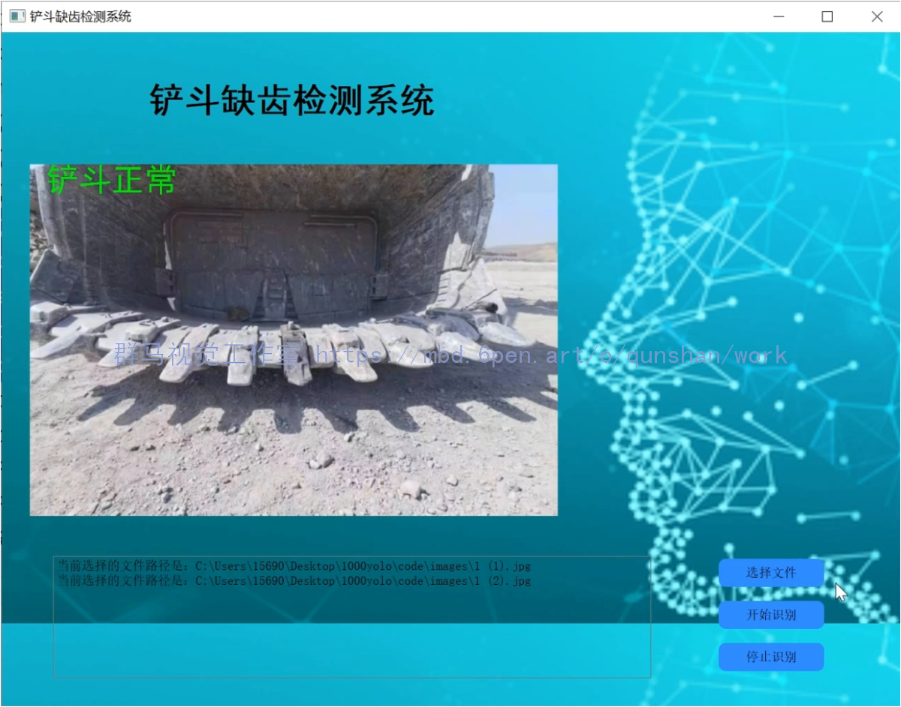
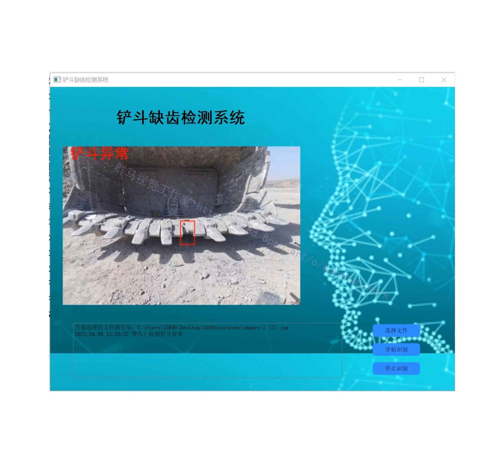
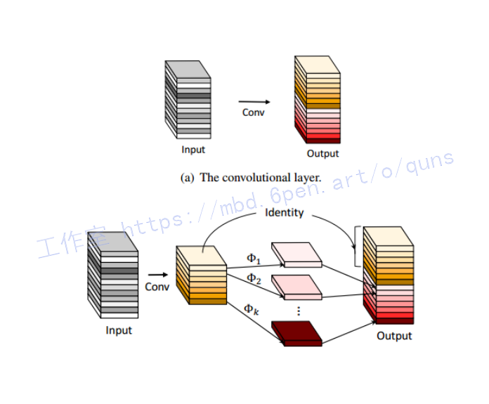
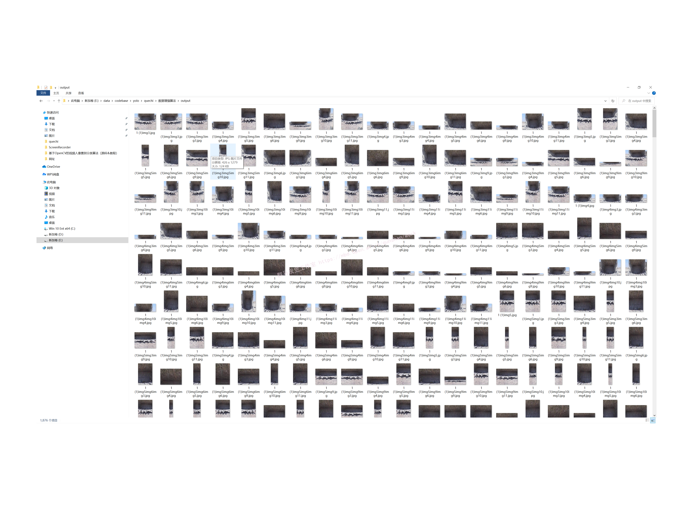

# 1.研究背景
针对现有电铲斗齿检测方法存在实时性较差、误报率较高等问题,提出了一种基于机器视觉的电铲斗齿缺失检测方法.该方法利用红外热像仪采集铲斗图像,基于模板匹配原理对复杂背景下斗齿的目标区域进行准确定位,利用帧差法实现斗齿的运动检测;在目标区域已定位的基础上,结合斗齿齿线区域的位置关系与齿线结构特征对斗齿进行分割提取,通过自适应阈值,实现对缺失斗齿的检测.实验结果表明,该方法实现了对电铲斗齿缺失的实时、在线、快速、准确检测,检测准确率达到90％以上,为电铲斗齿缺失检测提供了一种有效的解决方法.

# 2.图片演示




# 3.视频演示
[基于改进YOLOv5的挖机铲斗缺陷检测系统（源码＆教程）_哔哩哔哩_bilibili](https://www.bilibili.com/video/BV1EV4y1N7Eb/?vd_source=bc9aec86d164b67a7004b996143742dc)

# 4.改进YOLOv5
#### 参考[该博客的Gt model](https://mbd.pub/o/bread/Y5iblZ1x) 网络结构图


#### 代码实现
```
class GtModule(nn.Module):
    def __init__(self, inp, oup, kernel_size=1, ratio=2, dw_size=3, stride=1, relu=True):
        super(GtModule, self).__init__()
        self.oup = oup
        init_channels = math.ceil(oup / ratio)
        new_channels = init_channels*(ratio-1)
 
        self.primary_conv = nn.Sequential(
            nn.Conv2d(inp, init_channels, kernel_size, stride, kernel_size//2, bias=False),
            nn.BatchNorm2d(init_channels),
            nn.ReLU(inplace=True) if relu else nn.Sequential(),
        )
 
        self.cheap_operation = nn.Sequential(
            nn.Conv2d(init_channels, new_channels, dw_size, 1, dw_size//2, groups=init_channels, bias=False),
            nn.BatchNorm2d(new_channels),
            nn.ReLU(inplace=True) if relu else nn.Sequential(),
        )
 
    def forward(self, x):
        x1 = self.primary_conv(x)
        x2 = self.cheap_operation(x1)
        out = torch.cat([x1,x2], dim=1)
        return out[:,:self.oup,:,:]
```
由于嵌入式设备有限的内存和计算资源，在其上部署神经网络很困难，一般需要降低神经网络的大小和计算资源的占用。[该博客](https://afdian.net/item?plan_id=19179d745b3211eda7c452540025c377)将轻量型的Gt模块与YOLOv5算法相结合，可大幅降低网络参数量，在满足模型轻量化的同时，还可以加快原始网络推理速度。


# 5.改进YOLOv5颈部网络

#### 改进颈部网络的网络结构图
#### 代码实现
```
def depthwise_conv(inp, oup, kernel_size=3, stride=1, relu=False):
    return nn.Sequential(
        nn.Conv2d(inp, oup, kernel_size, stride, kernel_size//2, groups=inp, bias=False),
        nn.BatchNorm2d(oup),
        nn.ReLU(inplace=True) if relu else nn.Sequential(),
    )
 
class SELayer(nn.Module):
    def __init__(self, channel, reduction=4):
        super(SELayer, self).__init__()
        self.avg_pool = nn.AdaptiveAvgPool2d(1)
        self.fc = nn.Sequential(
                nn.Linear(channel, channel // reduction),
                nn.ReLU(inplace=True),
                nn.Linear(channel // reduction, channel),        )
 
    def forward(self, x):
        b, c, _, _ = x.size()
        y = self.avg_pool(x).view(b, c)
        y = self.fc(y).view(b, c, 1, 1)
        y = torch.clamp(y, 0, 1)
        return x * y
 
class GBneck(nn.Module):
    def __init__(self, inp, hidden_dim, oup, kernel_size, stride, use_se):
        super(GBneck, self).__init__()
        assert stride in [1, 2]
 
        self.conv = nn.Sequential(
            # pw
            GtModule(inp, hidden_dim, kernel_size=1, relu=True),
            # dw
            depthwise_conv(hidden_dim, hidden_dim, kernel_size, stride, relu=False) if stride==2 else nn.Sequential(),
            # Squeeze-and-Excite
            SELayer(hidden_dim) if use_se else nn.Sequential(),
            # pw-linear
            GtModule(hidden_dim, oup, kernel_size=1, relu=False),
        )
 
        if stride == 1 and inp == oup:
            self.shortcut = nn.Sequential()
        else:
            self.shortcut = nn.Sequential(
                depthwise_conv(inp, inp, 3, stride, relu=True),
                nn.Conv2d(inp, oup, 1, 1, 0, bias=False),
                nn.BatchNorm2d(oup),
            )
 
    def forward(self, x):
        return self.conv(x) + self.shortcut(x)
```
# 6.数据增强



# 7.系统整合
此处获取下图[源码＆环境部署视频教程＆数据集＆自定义UI界面](https://s.xiaocichang.com/s/bac3bf)


# 8.参考文献
[1]吴晓军,邹广华.基于边缘几何特征的高性能模板匹配算法[D].2013
[2]潘翔鹤,赵曙光,柳宗浦,等.一种基于梯度图像帧间差分和背景差分的运动目标检测新方法[D].2009
[3]齐凯,韩维国.大型矿用挖掘机--电铲概述[J].一重技术.2008,(1).5-6.
[4]崔星,闫清东.基于帧间差分方法的道路车辆检测系统[D].2007
[5]张恒,雷志辉,丁晓华.一种改进的中值滤波算法[D].2004
[6]汤恒.基于机器视觉的电铲斗齿脱落检测算法研究[D].2017
[7]关波.刀具几何参数图像测量技术研究[D].2015
[8]阳树洪.灰度图像阈值分割的自适应和快速算法研究[D].2014
[9]张美静.亚像素边缘检测技术研究[D].2013
[10]张恒.红外目标检测与识别理论与技术研究[D].2008
[11]周科嘉.基于HOG特征和模板匹配的行人检测与跟踪研究[D].2014


---
#### 如果您需要更详细的【源码和环境部署教程】，除了通过【系统整合】小节的链接获取之外，还可以通过邮箱以下途径获取:
#### 1.请先在GitHub上为该项目点赞（Star），编辑一封邮件，附上点赞的截图、项目的中文描述概述（About）以及您的用途需求，发送到我们的邮箱
#### sharecode@yeah.net
#### 2.我们收到邮件后会定期根据邮件的接收顺序将【完整源码和环境部署教程】发送到您的邮箱。
#### 【免责声明】本文来源于用户投稿，如果侵犯任何第三方的合法权益，可通过邮箱联系删除。